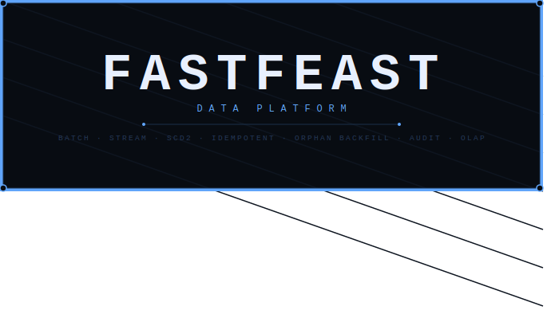
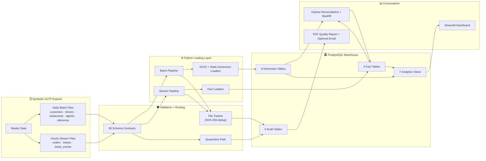
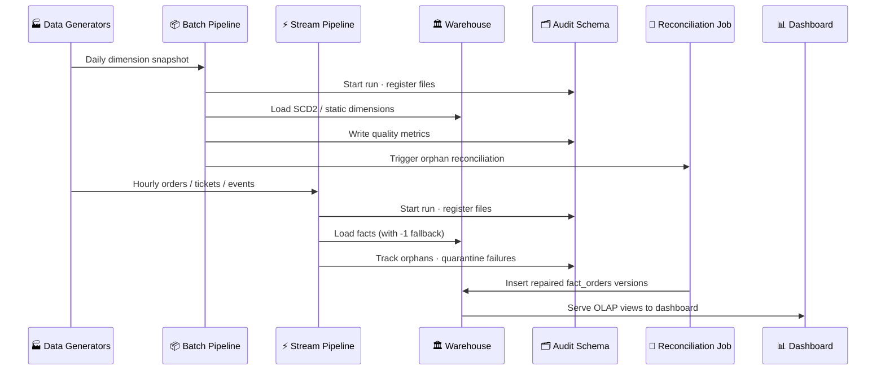
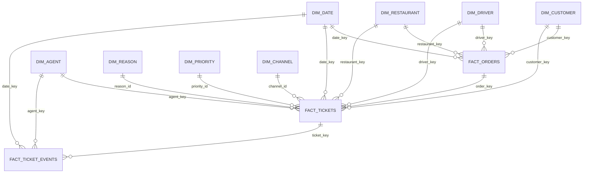
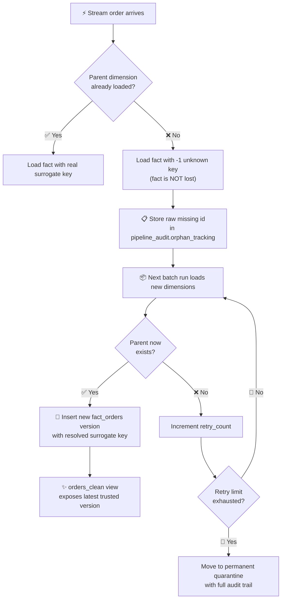

<div align="center">



### *A production-grade data platform that doesn't pretend your data is clean*

**Batch · Stream · SCD2 · Orphan Backfill · Audit Trails · Quarantine · OLAP Views · Streamlit**

<br/>

[](https://www.python.org/)
[](https://www.postgresql.org/)
[](https://www.docker.com/)
[](https://streamlit.io/)
[](https://docs.pytest.org/)
[](https://docs.pydantic.dev/)

<br/>

[Why It Stands Out](#-why-it-stands-out) · [Architecture](#-architecture) · [Warehouse Design](#-warehouse-design) · [Orphan Lifecycle](#-late-arriving-dimensions-the-orphan-lifecycle) · [Data Quality](#-data-quality--auditability) · [Quick Start](#-quick-start) · [Dashboard](#-dashboard) · [Testing](#-testing)

</div>

---

> **Most portfolio pipelines stop at "load CSV into a table."**
> FastFeast models the operational problems that make *real* data platforms hard — late-arriving facts, schema mismatches, duplicate runs, invalid records, and the audit trails that prove everything worked.

---

## 🏆 Why It Stands Out

| Real-World Problem | What FastFeast Does |
|---|---|
| Facts arrive before their dimension parents | Facts load with `-1` unknown keys; orphan tracker stores the raw foreign id for later resolution |
| Dimensions change over time | SCD Type 2 loaders preserve full attribute history — no silent overwrites |
| Files get accidentally reprocessed | SHA-256 file hashing + `file_tracker` table make every load idempotent |
| Invalid source records corrupt analytics | Validation layer quarantines bad rows as JSON — inspectable, not lost |
| Operators can't explain what ran | Every run writes to `pipeline_run_log`, `file_tracker`, and `pipeline_quality_metrics` |
| Analysts want clean, analysis-ready tables | `orders_clean` view always exposes the **latest trusted version** of each order |
| Reviewers can't reproduce the project locally | Docker Compose + CLI commands + synthetic generators make the demo reproducible |

---

## ⚡ At a Glance

```
8 Dimension Tables   ·   3 Fact Tables   ·   5 Audit Tables   ·   7 Analytics Views
38 Validation Contracts   ·   Batch + Stream pipelines   ·   SCD2 + Orphan Backfill
```

---

## 🏗️ Architecture



---

## 🔄 Pipeline Story



---

## 🏛️ Warehouse Design

FastFeast separates concerns cleanly: `warehouse` schema for analytical data, `pipeline_audit` schema for operational metadata.



### Warehouse Objects

| Layer | Count | Objects |
|---|:---:|---|
| **Dimensions** | 8 | Date · Customer · Driver · Restaurant · Agent · Reason · Channel · Priority |
| **Facts** | 3 | Orders · Support Tickets · Ticket Status Events |
| **Audit Tables** | 5 | Pipeline runs · File hashes · Quality metrics · Orphan tracking · Quarantine |
| **Analytics Views** | 7 | Clean orders · KPI summary · Location / Restaurant / Driver breakdowns · Reopen rate · Revenue impact |
| **Validation Contracts** | 38 | Source entities · Warehouse targets · Audit schema expectations |

### Dimensions

| Table | Type | Notes |
|---|:---:|---|
| `warehouse.dim_date` | Static | Hourly granularity date dimension |
| `warehouse.dim_customer` | **SCD2** | Includes `-1` unknown member for orphan facts |
| `warehouse.dim_driver` | **SCD2** | Includes `-1` unknown member for orphan facts |
| `warehouse.dim_restaurant` | **SCD2** | Includes `-1` unknown member for orphan facts |
| `warehouse.dim_agent` | **SCD2** | Loaded from batch; no unknown seed row needed |
| `warehouse.dim_reason` | Static | Support reason lookup |
| `warehouse.dim_channel` | Static | Support channel lookup |
| `warehouse.dim_priority` | Static | SLA priority lookup |

### Facts

| Table | Grain | Key Design Decision |
|---|---|---|
| `warehouse.fact_orders` | One row per **order version** | `(order_id, version)` composite key enables non-destructive backfill |
| `warehouse.fact_tickets` | One row per support ticket | Stores SLA breach flags and full timing metrics |
| `warehouse.fact_ticket_events` | One row per status event | Captures transition sequence and agent linkage |

---

## 🔁 Late-Arriving Dimensions: The Orphan Lifecycle

This is the most distinctive engineering feature. Stream facts load immediately — even when their dimension parents haven't arrived yet. Nothing is blocked. Nothing is silently dropped.



> **Why this matters:** The pipeline preserves the original loaded fact row and inserts a *corrected version* rather than silently rewriting history. Every repair is traceable — you can always reconstruct what the warehouse believed at any point in time.

---

## 🔍 Data Quality & Auditability

FastFeast keeps operational evidence for every important pipeline action. Nothing is ephemeral.

| Audit Object | What It Captures |
|---|---|
| `pipeline_audit.pipeline_run_log` | Run type · status · timestamps · file counts · record totals · error message |
| `pipeline_audit.file_tracker` | File path · SHA-256 hash · processing status · record counts |
| `pipeline_audit.pipeline_quality_metrics` | Valid / quarantined / orphaned record counts · null rates · duplicate rates · business-rule violations |
| `pipeline_audit.orphan_tracking` | Unresolved source ids · orphan type · retry count · resolution timestamp |
| `pipeline_audit.quarantine` | Raw rejected record as JSON · error type · error details · source file |

Validation contracts cover source entities, warehouse targets, and audit tables — enforcing required columns, data types, nullability rules, natural key uniqueness, categorical constraints, regex patterns, numeric ranges, and operational defaults.

A contract in `validators/schema_registry.py` is an immutable `SchemaContract` composed of `ColumnContract` rules. For example, stream order contracts declare the natural key, required IDs, numeric ranges, timestamp fields, and nullable orphan metadata before records are allowed into the warehouse flow.

---

## 📊 Analytics Layer

The dashboard reads from purpose-built warehouse views, not raw tables. Application-side aggregation is eliminated.

| View | Answers |
|---|---|
| `warehouse.orders_clean` | What is the latest trusted version of each order? |
| `warehouse.v_kpi_summary` | Ticket volumes · SLA rates · response times · refund totals |
| `warehouse.v_tickets_by_location` | Which regions and cities generate the most support load? |
| `warehouse.v_tickets_by_restaurant` | Which restaurants are linked to higher ticket volume or refunds? |
| `warehouse.v_tickets_by_driver` | Which drivers are linked to more SLA breaches? |
| `warehouse.v_ticket_reopen_rate` | How often are tickets reopened after resolution? |
| `warehouse.v_revenue_impact` | How much revenue is affected by refunds? |

---

## 📁 Repository Map

```text
FastFeast-Python-Project/
├── main.py                         # CLI: init-db · batch · stream · analytics
├── docker-compose.yml              # PostgreSQL + optional pgAdmin
├── requirements.txt                # Runtime and test dependencies
│
├── alerting/                       # SMTP report and alert delivery
├── analytics/                      # Analytics client + Streamlit dashboard
├── config/                         # Pydantic settings and config files
├── data_generators/                # Master · batch · stream · day simulation scripts
├── handlers/                       # Backfill · orphan · quarantine handlers
├── loaders/                        # SCD2 · static dimension · fact loaders
├── pipelines/                      # Batch · stream · watcher · reconciliation jobs
├── quality/                        # Metrics tracker + PDF quality report
├── tests/                          # pytest tests + inspection utilities
├── utils/                          # Logging · readers · file tracking · retry helpers
├── validators/                     # Schema registry + validation engine
├── warehouse/                      # DDL · seed data · analytics views · DB connection
└── quarantine_exports/             # Exported quarantine artifacts
```

### Project Snapshot

| Area | File |
|---|---|
| CLI entrypoint | `main.py` |
| Runtime config | `config/settings.py` (Pydantic) |
| Warehouse DDL | `warehouse/dwh_ddl.sql` |
| Audit DDL | `warehouse/audit_ddl.sql` |
| Analytics DDL | `warehouse/analytics_ddl.sql` |
| Batch pipeline | `pipelines/batch_pipeline.py` |
| Stream pipeline | `pipelines/stream_pipeline.py` |
| Orphan reconciliation | `pipelines/reconciliation_job.py` · `handlers/backfill_handler.py` |
| Validation contracts | `validators/schema_registry.py` |
| Quality layer | `quality/metrics_tracker.py` · `quality/quality_report.py` |
| Dashboard | `analytics/dashboard.py` |

### Reviewer Path

If you are reviewing the engineering design, start with these files:

| Start Here | Why It Matters |
|---|---|
| `warehouse/dwh_ddl.sql` | Defines the star schema, SCD2 dimensions, fact grains, and unknown-member strategy |
| `pipelines/stream_pipeline.py` | Shows hourly fact ingestion, validation, orphan handling, and audit logging |
| `handlers/backfill_handler.py` | Implements the late-arriving dimension repair flow for versioned orders |
| `validators/schema_registry.py` | Centralizes source, warehouse, and audit contracts used by validation |
| `analytics/dashboard.py` | Serves business-facing KPIs from warehouse views |

---

## 🚀 Quick Start

### Prerequisites

- Python 3.11+
- Docker Desktop or Docker Engine + Compose

### 1 — Python Environment

```bash
python -m venv .venv

# Windows PowerShell
.\.venv\Scripts\Activate.ps1

# macOS / Linux
source .venv/bin/activate

pip install -r requirements.txt
```

### 2 — Configure Secrets

```bash
cp .env.example .env

# Generate a real PII pepper
python -c "import secrets; print(secrets.token_hex(32))"
```

Add the output to `.env`:

```env
PII_HASH_PEPPER=<generated-value>

# Database defaults (Docker Compose)
POSTGRES_HOST=localhost
POSTGRES_PORT=5432
POSTGRES_DB=fastfeast_db
POSTGRES_USER=fastfeast
POSTGRES_PASSWORD=fastfeast_pass
```

### 3 — Start PostgreSQL

```bash
docker compose up -d postgres

# Optional pgAdmin at http://localhost:5050
docker compose --profile tools up -d
```

### 4 — Initialize the Warehouse

```bash
python main.py init-db --with-seed
```

This applies `audit_ddl.sql`, `dwh_ddl.sql`, `seed.sql`, and generates the hourly date dimension.

### 5 — Generate Source Data

```bash
python data_generators/generate_master_data.py
python data_generators/generate_batch_data.py --date 2026-04-10
python data_generators/generate_stream_data.py --date 2026-04-10 --hour 12

# Or simulate a multi-hour day
python data_generators/simulate_day.py --date 2026-04-10
```

### 6 — Run the Pipelines

```bash
python main.py batch --date 2026-04-10
python main.py stream --date 2026-04-10 --hour 12

# Continuous watcher mode
python main.py stream --watch
```

### 7 — Launch the Dashboard

```bash
python main.py analytics setup
python main.py analytics dashboard
# → http://localhost:8501
```

---

## 🖥️ Command Reference

| Command | What It Does |
|---|---|
| `python main.py init-db` | Applies audit + warehouse DDL, loads date dimension |
| `python main.py init-db --with-seed` | Also inserts `-1` unknown rows for customer, driver, restaurant |
| `python main.py batch --date YYYY-MM-DD` | Loads daily dimensions + runs orphan reconciliation |
| `python main.py stream --date YYYY-MM-DD --hour HH` | Loads one hour of orders, tickets, and events |
| `python main.py stream --watch` | Runs the continuous file watcher |
| `python main.py analytics setup` | Creates analytics views |
| `python main.py analytics dashboard` | Starts Streamlit at localhost:8501 |

---

## 🏭 Data Generators

| Script | Purpose |
|---|---|
| `generate_master_data.py` | Creates base synthetic source entities |
| `generate_batch_data.py --date YYYY-MM-DD` | Creates one day of dimension snapshots |
| `generate_stream_data.py --date YYYY-MM-DD --hour HH` | Creates one hour of stream facts |
| `simulate_day.py --date YYYY-MM-DD` | Runs a multi-hour day simulation |
| `add_new_customers.py --count N` | Adds N new customers to master data |
| `add_new_drivers.py --count N` | Adds N new drivers to master data |

Source files are generated locally so the same project can be rerun with fresh operational scenarios, including new parent entities that arrive after stream facts have already been loaded.

---

## 📈 Dashboard

The Streamlit dashboard focuses on support operations and revenue impact — all backed by warehouse views, not application-level queries.

**KPI Cards:** Total tickets · SLA first-response breach rate · SLA resolution breach rate · Avg first response time · Avg resolution time · Reopen rate · Total refund amount · Net revenue and refund impact

**Breakdown Views:** Tickets by location · Tickets by restaurant · Tickets by driver · Recent ticket details

---

## 🧪 Testing

```bash
# Run all pytest-discoverable tests
pytest

# Focused integration tests
pytest tests/test_orphan_resolution_flow.py
pytest tests/test_quality_report_email_integration.py

# Executable inspection scripts
python tests/test_alert.py
python tests/test_file_tracker.py
python tests/test_orphan.py
python tests/test_watcher.py
python tests/inspect_audit_schema.py
```

> Database-backed tests require a running PostgreSQL instance and a valid `.env` file.

---

## ⚙️ Full Configuration Reference

```env
# Required
PII_HASH_PEPPER=<secret>

# Database
POSTGRES_HOST=localhost
POSTGRES_PORT=5432
POSTGRES_DB=fastfeast_db
POSTGRES_USER=fastfeast
POSTGRES_PASSWORD=fastfeast_pass

# File paths
BATCH_INPUT_DIR=data/input/batch
STREAM_INPUT_DIR=data/input/stream
QUARANTINE_DIR=data/quarantine
PROCESSED_DIR=data/processed
LOG_DIR=logs

# Alerting (optional)
ALERTING_ENABLED=true
SMTP_HOST=smtp.gmail.com
SMTP_PORT=587
SMTP_USER=
SMTP_PASSWORD=
ALERT_RECIPIENTS=
REPORT_RECIPIENTS=
```

> ⚠️ **Never commit `.env` or your `PII_HASH_PEPPER` to version control.**

---

## 🩺 Troubleshooting

<details>
<summary><strong>PostgreSQL is not reachable</strong></summary>

```bash
docker compose ps
docker compose up -d postgres
```
</details>

<details>
<summary><strong>`PII_HASH_PEPPER` is missing or invalid</strong></summary>

```bash
python -c "import secrets; print(secrets.token_hex(32))"
```
</details>

<details>
<summary><strong>Stream facts fail due to missing `-1` keys</strong></summary>

```bash
python main.py init-db --with-seed
```
</details>

<details>
<summary><strong>Files are silently skipped on rerun</strong></summary>

This is expected behavior. The pipeline records every processed file in `pipeline_audit.file_tracker` using SHA-256 hashes. Re-running the same file is idempotent by design.
</details>

<details>
<summary><strong>Orphans remain unresolved after multiple batch runs</strong></summary>

The missing parent entity may have been absent or quarantined during batch. The orphan stays open until a valid batch record arrives or the retry limit sends it to permanent quarantine.
</details>

<details>
<summary><strong>Quarantine volume is unexpectedly high</strong></summary>

```sql
SELECT entity_type, error_type, error_details, COUNT(*)
FROM pipeline_audit.quarantine
GROUP BY entity_type, error_type, error_details
ORDER BY COUNT(*) DESC;
```
</details>

---

## 🔬 Technical Highlights

- **End-to-end CLI** for warehouse initialization, batch loading, stream loading, file watcher mode, and analytics setup
- **PostgreSQL warehouse** with fully separated dimension, fact, audit, and analytics layers
- **SCD Type 2** dimension loading for customers, drivers, restaurants, and agents — history is preserved, never overwritten
- **Versioned fact repair** for late-arriving dimensions — original rows are kept; corrections are inserted as new versions
- **Dedicated audit schema** — run logs, file tracking, quality metrics, orphan tracking, and quarantine in one queryable place
- **38 validation contracts** covering source, warehouse, and audit entities with column-level rules
- **Idempotent pipeline design** — SHA-256 file hashing prevents duplicate processing at the loader level
- **Synthetic data generators** for fully reproducible local demonstrations with no external dependencies
- **Streamlit dashboard** backed by warehouse OLAP views — no ad hoc application-side aggregation

---

<div align="center">

<br/>

```
+---------------------------------------------------------------+
| FastFeast doesn't pretend operational data is clean.           |
| It builds the machinery to make it trustworthy.                |
+---------------------------------------------------------------+
```

Built with **Python** · **PostgreSQL** · **Docker** · **Pydantic** · **pytest** · **Streamlit**

<br/>

*If this project helped you, a ⭐ goes a long way.*

</div>
