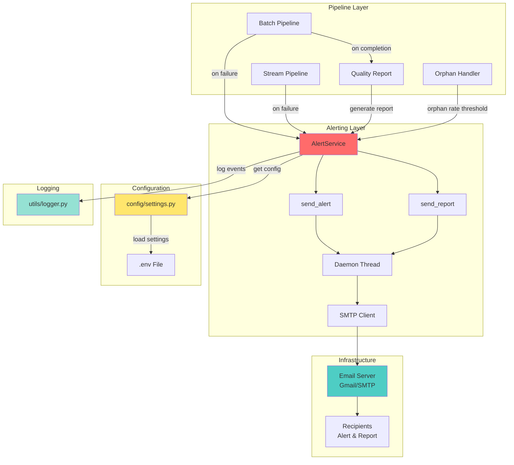

# Alerting Directory

## Definition

The `alerting/` directory contains the email notification service for the FastFeast data pipeline. It provides asynchronous, fire-and-forget email alerts for pipeline failures, quality reports, and SLA breaches.

## What It Does

The alerting service sends email notifications in the following scenarios:

- **Pipeline Failures**: When the batch or stream pipeline encounters critical errors
- **Quality Reports**: Daily PDF quality reports after batch pipeline completion
- **SLA Breaches**: When SLA breach rates exceed configured thresholds
- **Orphan Rate Alerts**: When orphan reference rates exceed configured thresholds
- **Error Rate Alerts**: When error rates exceed configured thresholds

## Why It Exists

The alerting service is essential for:

- **Operational Awareness**: Ensuring data engineers and stakeholders are immediately notified of pipeline issues
- **Quality Monitoring**: Providing daily visibility into data quality metrics through PDF reports
- **SLA Compliance**: Alerting when service level agreements are at risk of being breached
- **Non-Blocking Operation**: Using background threads to send emails without blocking pipeline execution

## How It Works

### Core Components

#### AlertService Class
A simple wrapper class that provides two main methods:
- `send_alert()`: Sends fire-and-forget error alerts
- `send_report()`: Sends fire-and-forget report emails with PDF attachments

#### Asynchronous Email Sending
- Uses daemon threads to send emails in the background
- Never blocks the main pipeline execution
- Automatically cleans up threads on interpreter shutdown via `atexit` handler

#### SMTP Integration
- Supports any SMTP server (Gmail, corporate email servers, etc.)
- Configurable via environment variables
- TLS encryption for secure email transmission

### Key Functions

#### `send_alert(error_type, message, run_id)`
Sends an asynchronous error alert email. Parameters:
- `error_type`: Type of error (e.g., "PIPELINE_FAILURE", "SCHEMA_VALIDATION_FAILED")
- `message`: Detailed error message
- `run_id`: Optional pipeline run ID for tracking

#### `send_report(subject, message, pdf_bytes, filename, run_id)`
Sends an asynchronous report email with PDF attachment. Parameters:
- `subject`: Email subject line
- `message`: Email body text
- `pdf_bytes`: PDF file content as bytes
- `filename`: Name of the attached PDF file
- `run_id`: Optional pipeline run ID for tracking

### Configuration

The alerting service is configured via environment variables in `.env`:

```bash
# Enable/disable alerting
ALERTING_ENABLED=true

# SMTP configuration
SMTP_HOST=smtp.gmail.com
SMTP_PORT=587
SMTP_USER=your-email@gmail.com
SMTP_PASSWORD=your-app-password
SENDER_NAME=FastFeast Pipeline

# Recipients
ALERT_RECIPIENTS=["ops@example.com", "data-team@example.com"]
REPORT_RECIPIENTS=["quality@example.com"]

# Thresholds
MAX_ORPHAN_RATE=0.50
MAX_ERROR_RATE=0.10
```

### Email Templates

#### Alert Email Template
```
FastFeast Pipeline Alert
========================
Error Type : {error_type}
Run ID     : {run_id}
Time       : {timestamp}

Details:
{message}

-- FastFeast Pipeline
```

#### Quality Report Email Template
```
FastFeast Daily Quality Report
==============================
Run ID: {run_id}
Generated At: {timestamp}

{message}

This email contains an aggregate quality report attachment for operational review.

Regards,
FastFeast Data Platform
```

## Relationship with Architecture

### Architecture Diagram



### Dependencies
- **config/settings.py**: Provides configuration via `get_settings()`
- **utils/logger.py**: Provides structured logging for alert events

### Used By
- **pipelines/batch_pipeline.py**: Sends quality reports after batch completion
- **pipelines/stream_pipeline.py**: Sends alerts on stream pipeline failures
- **quality/quality_report.py**: Triggers report generation and email sending
- **handlers/orphan_handler.py**: Sends alerts when orphan rates exceed thresholds

### Integration Points
1. **Batch Pipeline**: After successful batch run, generates and emails PDF quality report
2. **Stream Pipeline**: On critical failures, sends immediate alert emails
3. **Quality Layer**: When quality thresholds are breached, sends alert emails
4. **Orphan Handler**: When orphan resolution fails or rates are high, sends alerts

## Error Handling

The alerting service is designed to never fail the pipeline:
- Email failures are logged but do not raise exceptions
- Background thread failures are caught and logged silently
- Missing configuration (empty recipient lists) results in skipped alerts with logging

## Security Considerations

- SMTP passwords should use app-specific passwords (not regular passwords)
- Credentials are stored in `.env` file (not committed to git)
- Alert emails may contain sensitive operational information
- Recipient lists should be carefully managed

## Testing

The alerting service can be tested by:
1. Setting `ALERTING_ENABLED=true` in `.env`
2. Configuring valid SMTP credentials
3. Running a batch pipeline to trigger quality report email
4. Intentionally causing a pipeline failure to test alert emails
