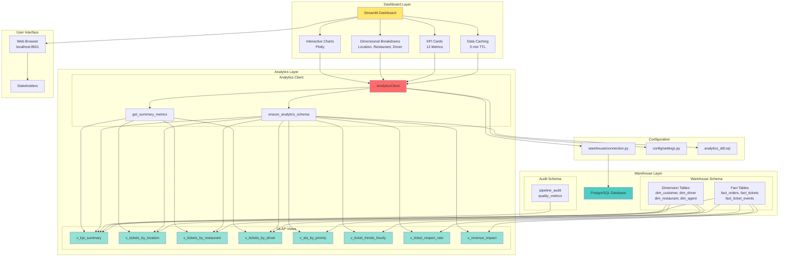

# Analytics Directory

## Definition

The `analytics/` directory contains the analytics layer for the FastFeast data pipeline, including OLAP views definition and a Streamlit-based interactive dashboard for visualizing KPIs and operational metrics.

## What It Does

The analytics layer provides:

- **OLAP Views**: Pre-built database views that aggregate and transform warehouse data for common analytics queries
- **Interactive Dashboard**: A Streamlit web application for real-time KPI monitoring and data visualization
- **KPI Calculations**: Key performance indicators for ticket volume, SLA compliance, resolution times, and refund impact
- **Dimensional Breakdowns**: Analytics by location, restaurant, driver, and other dimensions

## Why It Exists

The analytics layer is essential for:

- **Operational Visibility**: Providing real-time visibility into support ticket performance and SLA compliance
- **Data Exploration**: Enabling stakeholders to explore data through interactive visualizations
- **Performance Monitoring**: Tracking KPIs like SLA breach rates, resolution times, and refund impact
- **Decision Making**: Supporting data-driven decisions through aggregated metrics and trends
- **OLAP Optimization**: Pre-computing aggregations in database views for faster query performance

## How It Works

### Core Components

#### `__init__.py` - Analytics Client
Contains the `AnalyticsClient` class and helper functions:
- `AnalyticsClient`: Main class for querying analytics data from the database
- `ensure_analytics_schema()`: Creates all OLAP views in the database
- `get_summary_metrics()`: Retrieves aggregate KPI metrics

#### `dashboard.py` - Streamlit Dashboard
Interactive web application with:
- KPI cards showing key metrics at a glance
- Dimensional breakdowns (by location, restaurant, driver)
- Interactive charts using Plotly
- Real-time data refresh with 5-minute caching
- Export capabilities for data tables

### Key Functions

#### `ensure_analytics_schema()`
Creates all OLAP views in the warehouse schema. Views include:
- `v_kpi_summary`: Overall KPI summary
- `v_tickets_by_location`: Tickets aggregated by city/region
- `v_tickets_by_restaurant`: Tickets aggregated by restaurant
- `v_tickets_by_driver`: Tickets aggregated by driver
- `v_sla_by_priority`: SLA metrics by priority level
- `v_ticket_trends_hourly`: Hourly ticket trends
- `v_ticket_reopen_rate`: Ticket reopen rate calculation
- `v_revenue_impact`: Revenue impact from refunds

#### AnalyticsClient Methods
- `get_kpi_summary()`: Returns overall KPI metrics (total tickets, SLA breach rates, resolution times, refunds)
- `get_reopen_rate()`: Returns ticket reopen rate statistics
- `get_revenue_impact()`: Returns revenue impact analysis
- `get_tickets_by_location(top_n)`: Returns top N locations by ticket volume
- `get_tickets_by_restaurant(top_n)`: Returns top N restaurants by ticket volume
- `get_tickets_by_driver(top_n)`: Returns top N drivers by ticket volume

### Dashboard Features

#### KPI Cards
The dashboard displays 12 key metrics:
1. **Total Tickets**: Total number of support tickets
2. **SLA Breach Rate**: Percentage of tickets breaching SLA thresholds
3. **Avg Resolution Time**: Average time to resolve tickets (in minutes)
4. **Reopen Rate**: Percentage of tickets that were reopened
5. **Total Refunds**: Total refund amount
6. **Net Revenue**: Net revenue after refunds
7. **Avg Refund**: Average refund amount
8. **Refund Impact**: Refund amount as percentage of revenue
9. **Avg First Response**: Average first response time (in minutes)
10. **First Response SLA Breach**: Percentage breaching first response SLA
11. **Resolution SLA Breach**: Percentage breaching resolution SLA
12. **Tickets w/ Refund**: Number of tickets with refunds

#### Dimensional Breakdowns
- **By Location**: Top cities by ticket volume and SLA breach rates
- **By Restaurant**: Top restaurants by ticket volume, resolution time vs volume scatter plot
- **By Driver**: Top drivers by ticket volume, resolution time by vehicle type

### Data Caching
The dashboard uses Streamlit's `@st.cache_data(ttl=300)` decorator to cache query results for 5 minutes, reducing database load and improving performance.

## Relationship with Architecture

### Architecture Diagram



### Dependencies
- **warehouse/connection.py**: Database connection pool and query execution
- **config/settings.py**: Configuration for database connection
- **warehouse/analytics_ddl.sql**: SQL DDL for creating OLAP views

### Used By
- **main.py**: CLI command `python main.py analytics setup` creates views
- **main.py**: CLI command `python main.py analytics dashboard` launches Streamlit
- **Stakeholders**: Access dashboard at http://localhost:8501 for operational monitoring

### Integration Points
1. **Warehouse Schema**: OLAP views query dimension and fact tables
2. **Pipeline Audit**: Some views incorporate quality metrics from audit schema
3. **Web Browser**: Dashboard accessed via web browser on port 8501

## OLAP View Definitions

### v_kpi_summary
Aggregates overall KPIs from fact_tickets and related dimensions:
- Total ticket count
- SLA breach rates (first response and resolution)
- Average resolution and first response times
- Total and average refund amounts
- Ticket counts with refunds

### v_tickets_by_location
Aggregates tickets by city and region:
- Total tickets per city
- SLA breach rate per city
- Total refund amount per city
- Joins with dim_city and dim_region

### v_tickets_by_restaurant
Aggregates tickets by restaurant:
- Total tickets per restaurant
- Average resolution time per restaurant
- Total refund amount per restaurant
- Joins with dim_restaurant and dim_category

### v_tickets_by_driver
Aggregates tickets by driver:
- Total tickets per driver
- Average resolution time per driver
- Joins with dim_driver

### v_sla_by_priority
Aggregates SLA metrics by priority level:
- SLA breach rates per priority
- Average resolution times per priority
- Joins with dim_priority

### v_ticket_trends_hourly
Aggregates ticket trends by hour:
- Ticket counts per hour
- SLA breach rates per hour
- Uses dim_date for time-based analysis

### v_ticket_reopen_rate
Calculates ticket reopen rate:
- Percentage of tickets that were reopened after resolution
- Uses fact_ticket_events to track status changes

### v_revenue_impact
Calculates revenue impact from refunds:
- Total revenue from orders
- Total refund amount
- Refund impact rate (refunds as percentage of revenue)

## Running the Dashboard

### Setup Analytics Views
```bash
python main.py analytics setup
```

### Launch Dashboard
```bash
python main.py analytics dashboard
```

Or directly with Streamlit:
```bash
streamlit run analytics/dashboard.py
```

### Access
Open browser to: http://localhost:8501

## Performance Considerations

- **View Materialization**: OLAP views are not materialized by default; consider materializing for large datasets
- **Query Optimization**: Views use appropriate indexes on underlying tables
- **Caching**: Dashboard caches results for 5 minutes to reduce database load
- **Connection Pooling**: Uses the same connection pool as the pipeline

## Security Considerations

- Dashboard should be deployed behind authentication in production
- Database credentials are stored in `.env` file
- Consider using Streamlit authentication for multi-user deployments
- Dashboard may expose sensitive operational metrics

## Extending the Analytics Layer

### Adding New Views
1. Define the view SQL in `warehouse/analytics_ddl.sql`
2. Add a method to `AnalyticsClient` to query the new view
3. Add visualization in `dashboard.py` if needed
4. Call `ensure_analytics_schema()` to create the view

### Adding New KPIs
1. Add calculation to appropriate OLAP view
2. Add KPI card to dashboard in `render_kpi_cards()`
3. Update `load_kpi_summary()` to fetch the new metric
