# Data Generators Directory

## Definition

The `data_generators/` directory contains scripts to generate synthetic test data for the FastFeast data pipeline. These scripts create realistic dimension data (customers, drivers, restaurants, agents) and transactional data (orders, tickets, events) with intentional data quality issues to test the pipeline's validation and quality handling capabilities.

## What It Does

The data generators create:

- **Master Data**: Initial dimension tables (customers, drivers, restaurants, agents, and lookup tables)
- **Batch Data**: Daily snapshots of dimension data with realistic drift and changes
- **Stream Data**: Hourly micro-batches of transactional data (orders, tickets, events)
- **Data Quality Issues**: Intentional null values, invalid formats, duplicates, and orphan references
- **Realistic Patterns**: Egyptian names, phone numbers, restaurant categories, and business logic

## Why It Exists

The data generators are essential for:

- **Testing**: Providing realistic test data for pipeline development and testing
- **Quality Validation**: Creating data with known quality issues to test validation logic
- **Orphan Testing**: Generating orphan references to test reconciliation logic
- **Development**: Enabling local development without requiring production data
- **Demonstration**: Showcasing pipeline capabilities with realistic scenarios

## How It Works

### Core Components

#### `generate_master_data.py` - Master Data Generator
Creates initial dimension data that should be run once at setup:
- **Lookup Tables**: cities, regions, segments, categories, teams, reason_categories, reasons, channels, priorities
- **Entity Tables**: customers, drivers, restaurants, agents
- **Metadata**: Tracks max IDs for incremental generation
- **Data Quality Issues**: ~20-25% of records have intentional quality issues (nulls, invalid formats, duplicates)

#### `generate_batch_data.py` - Batch Data Generator
Creates daily snapshots of dimension data with drift:
- **Customer Drift**: New customers, profile changes, segment changes
- **Driver Drift**: New drivers, rating changes, status changes
- **Restaurant Drift**: Rating changes, status changes, category changes
- **Agent Drift**: New agents, skill level changes, team changes
- **Incremental IDs**: Uses metadata to continue from where master data left off

#### `generate_stream_data.py` - Stream Data Generator
Creates hourly micro-batches of transactional data:
- **Orders**: New orders with realistic amounts, statuses, and delivery times
- **Tickets**: Support tickets with reasons, priorities, SLA tracking
- **Events**: Ticket lifecycle events (status changes, responses)
- **Orphan References**: Intentionally creates orders/tickets referencing non-existent dimension keys
- **Data Quality Issues**: ~15-20% of records have quality issues

#### `add_new_customers.py` - Incremental Customer Generator
Adds new customers to the master data:
- Generates new customer records with Egyptian names
- Assigns regions and segments
- Creates realistic contact information
- Updates metadata with new max customer ID

#### `add_new_drivers.py` - Incremental Driver Generator
Adds new drivers to the master data:
- Generates new driver records with Egyptian names
- Assigns vehicles, shifts, and regions
- Creates realistic performance metrics
- Updates metadata with new max driver ID

#### `simulate_day.py` - Daily Simulation Script
Simulates a full day of data generation:
- Generates batch data for a specific date
- Generates stream data for each hour of the day
- Orchestrates the complete data generation workflow

### Data Quality Issues

The generators intentionally create various data quality issues:

#### Null Values
- Missing required fields (customer_name, driver_name, restaurant_name)
- Missing foreign keys (region_id, category_id, team_id)

#### Invalid Formats
- Invalid email addresses
- Invalid phone numbers
- Invalid national IDs
- Invalid vehicle types
- Invalid rating values (out of range)

#### Duplicates
- Duplicate customer records (~2%)
- Duplicate driver records (~1%)

#### Orphan References
- Orders referencing non-existent customer/driver/restaurant IDs
- Tickets referencing non-existent agents
- Used to test orphan detection and reconciliation

#### Logical Inconsistencies
- Negative ratings
- On-time rates outside 0-1 range
- Cancel rates outside 0-1 range

### Data Patterns

#### Egyptian Context
- Egyptian names (first and last names)
- Egyptian phone number formats (010, 011, 012, 015 prefixes)
- Egyptian cities (Cairo, Giza, Alexandria)
- Egyptian restaurant categories (Koshary, Shawarma)

#### Business Logic
- Restaurant categories have realistic prep time ranges
- Driver performance based on tenure
- Agent skill level based on hire date
- SLA thresholds by priority level
- Refund percentages by reason severity

### Key Functions

#### `generate_master_data.py`
- `gen_cities()`: Generates city lookup table
- `gen_regions()`: Generates region lookup table with delivery fees
- `gen_customers()`: Generates customer entity table
- `gen_drivers()`: Generates driver entity table
- `gen_restaurants()`: Generates restaurant entity table
- `gen_agents()`: Generates agent entity table
- `save_metadata()`: Saves max IDs for incremental generation

#### `generate_batch_data.py`
- `generate_customer_drift()`: Creates daily customer changes
- `generate_driver_drift()`: Creates daily driver changes
- `generate_restaurant_drift()`: Creates daily restaurant changes
- `generate_agent_drift()`: Creates daily agent changes

#### `generate_stream_data.py`
- `generate_orders()`: Generates order records for an hour
- `generate_tickets()`: Generates ticket records for an hour
- `generate_events()`: Generates ticket event records for an hour
- `generate_orders()`: Creates orphan references for testing

## Relationship with Architecture

### Architecture Diagram

```mermaid
graph TB
    subgraph "Data Generators"
        GMD[generate_master_data.py]
        GBD[generate_batch_data.py]
        GSD[generate_stream_data.py]
        ANC[add_new_customers.py]
        AND[add_new_drivers.py]
        SD[simulate_day.py]
    end

    subgraph "Generated Data"
        subgraph "Master Data"
            MD[data/master/]
            LK[Lookup Tables<br/>cities, regions, segments<br/>categories, teams, reasons]
            ET[Entity Tables<br/>customers, drivers<br/>restaurants, agents]
            MET[metadata.json]
        end
        subgraph "Batch Data"
            BD[data/input/batch/YYYY-MM-DD/]
            BCSV[CSV Files<br/>customers, drivers, agents]
            BJSON[JSON Files<br/>restaurants, cities]
        end
        subgraph "Stream Data"
            SDIR[data/input/stream/YYYY-MM-DD/HH/]
            SJSON[JSON Files<br/>orders, events]
            SCSV[CSV Files<br/>tickets]
        end
    end

    subgraph "Pipeline Layer"
        BP[Batch Pipeline]
        SP[Stream Pipeline]
        LD[Loaders]
        VL[Validators]
    end

    subgraph "Data Quality"
        DQI[Data Quality Issues<br/>~20-25%]
        NV[Null Values]
        IF[Invalid Formats]
        DP[Duplicates]
        OR[Orphan References]
        LI[Logical Inconsistencies]
    end

    subgraph "Dependencies"
        PD[pandas]
        RD[random]
        DT[datetime]
        JS[json]
    end

    GMD --> MD
    GMD --> MET
    GBD --> BD
    GSD --> SDIR
    ANC --> MD
    ANC --> MET
    AND --> MD
    AND --> MET
    SD --> GBD
    SD --> GSD

    MD --> LK
    MD --> ET
    BD --> BCSV
    BD --> BJSON
    SDIR --> SJSON
    SDIR --> SCSV

    BD --> BP
    SDIR --> SP
    MD --> LD
    BD --> LD
    SDIR --> LD
    BD --> VL
    SDIR --> VL

    GMD --> DQI
    GBD --> DQI
    GSD --> DQI
    DQI --> NV
    DQI --> IF
    DQI --> DP
    DQI --> OR
    DQI --> LI

    GMD --> PD
    GBD --> PD
    GSD --> PD
    GMD --> RD
    GBD --> RD
    GSD --> RD
    GMD --> DT
    GBD --> DT
    GSD --> DT
    GSD --> JS

    style GMD fill:#ff6b6b
    style GBD fill:#ff6b6b
    style GSD fill:#ff6b6b
    style MD fill:#4ecdc4
    style BD fill:#4ecdc4
    style SDIR fill:#4ecdc4
    style BP fill:#ffe66d
    style SP fill:#ffe66d
    style DQI fill:#95e1d3
```



### Dependencies
- **pandas**: For DataFrame operations and CSV/JSON writing
- **random**: For random data generation
- **datetime**: For date/time generation
- **json**: For JSON file writing

### Used By
- **pipelines/batch_pipeline.py**: Reads batch data from `data/input/batch/`
- **pipelines/stream_pipeline.py**: Reads stream data from `data/input/stream/`
- **loaders/**: Loaders read generated files for dimension and fact loading
- **validators/**: Validators test against generated data with quality issues

### Integration Points
1. **Master Data**: Run once to populate `data/master/` with initial dimensions
2. **Batch Data**: Run daily to populate `data/input/batch/YYYY-MM-DD/` with dimension snapshots
3. **Stream Data**: Run hourly to populate `data/input/stream/YYYY-MM-DD/HH/` with transactional data
4. **Pipeline Input**: Generated files serve as input for batch and stream pipelines

## Running the Generators

### Generate Master Data (Run Once)
```bash
python data_generators/generate_master_data.py
```
Output: `data/master/*.csv` files

### Generate Batch Data for a Date
```bash
python data_generators/generate_batch_data.py --date 2026-04-25
```
Output: `data/input/batch/2026-04-25/*.csv` and `*.json` files

### Generate Stream Data for an Hour
```bash
python data_generators/generate_stream_data.py --date 2026-04-25 --hour 12
```
Output: `data/input/stream/2026-04-25/12/*.csv` and `*.json` files

### Add New Customers
```bash
python data_generators/add_new_customers.py --count 50
```
Output: Updates `data/master/customers.csv` and `metadata.json`

### Add New Drivers
```bash
python data_generators/add_new_drivers.py --count 20
```
Output: Updates `data/master/drivers.csv` and `metadata.json`

### Simulate a Full Day
```bash
python data_generators/simulate_day.py --date 2026-04-25
```
Output: Generates both batch and stream data for the entire day

## Output Structure

### Master Data Structure
```
data/master/
├── cities.csv
├── regions.csv
├── segments.csv
├── categories.csv
├── teams.csv
├── reason_categories.csv
├── reasons.csv
├── channels.csv
├── priorities.csv
├── customers.csv
├── drivers.csv
├── restaurants.csv
├── agents.csv
└── metadata.json
```

### Batch Data Structure
```
data/input/batch/YYYY-MM-DD/
├── customers.csv
├── drivers.csv
├── restaurants.json
├── agents.csv
├── regions.csv
├── cities.json
├── segments.csv
├── categories.csv
├── teams.csv
├── reason_categories.csv
├── reasons.csv
├── channels.csv
└── priorities.csv
```

### Stream Data Structure
```
data/input/stream/YYYY-MM-DD/HH/
├── orders.json
├── tickets.csv
└── events.json
```

## Configuration

The generators use hardcoded constants for data generation:
- `INITIAL_CUSTOMERS = 500`
- `INITIAL_RESTAURANTS = 60`
- `INITIAL_DRIVERS = 100`
- `NUM_AGENTS = 30`
- `SEED = 42` (for reproducible random generation)

These can be modified in the respective generator scripts to change data volume.

## Testing with Generated Data

The generated data is designed to test:
1. **Schema Validation**: Invalid formats and data types
2. **Null Validation**: Missing required fields
3. **Duplicate Detection**: Duplicate records
4. **Orphan Detection**: References to non-existent dimensions
5. **SCD2 Logic**: Dimension changes over time
6. **Quality Metrics**: Quality rate calculations
7. **Reconciliation**: Orphan resolution when dimensions arrive

## Extending the Generators

### Adding New Entity Types
1. Create generator function following existing patterns
2. Add to main() function in appropriate generator script
3. Include data quality issues (~20% rate)
4. Update output structure documentation

### Adding New Data Quality Issues
1. Add new issue type to random choice in generator
2. Implement the issue generation logic
3. Ensure validators can detect the issue
4. Update documentation

### Changing Data Volume
1. Modify INITIAL_* constants in `generate_master_data.py`
2. Adjust batch drift percentages in `generate_batch_data.py`
3. Adjust hourly volume in `generate_stream_data.py`
