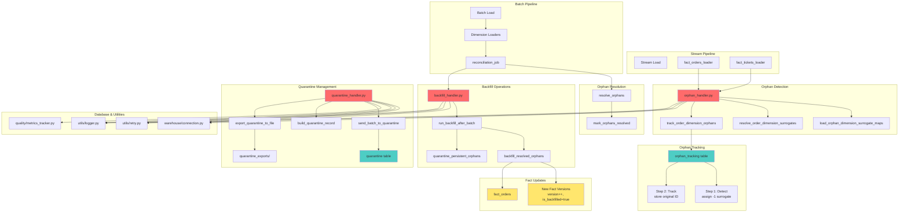

# Handlers Directory

## Definition

The `handlers/` directory contains specialized handler modules that manage specific pipeline operations including orphan detection/resolution, quarantine management, and backfill operations. These handlers encapsulate complex business logic that would otherwise clutter the main pipeline code.

## What It Does

The handlers provide:

- **Orphan Detection**: Detects and tracks orphan references in stream data (orders/tickets referencing non-existent dimensions)
- **Orphan Resolution**: Resolves orphan references when new dimension data arrives via batch pipeline
- **Quarantine Management**: Isolates invalid records with detailed error tracking
- **Backfill Operations**: Updates fact records with corrected dimension keys after orphan resolution

## Why It Exists

The handlers are essential for:

- **Separation of Concerns**: Keeping complex business logic separate from pipeline orchestration
- **Reusability**: Reusing orphan detection/resolution logic across batch and stream pipelines
- **Testability**: Isolating complex logic for unit testing
- **Maintainability**: Making it easier to understand and modify specific operations
- **Data Quality**: Ensuring orphan references are properly tracked and eventually resolved

## How It Works

### Core Components

#### `orphan_handler.py` - Orphan Detection and Tracking
Handles orphan detection during stream loading:
- **Step 1 of 3**: Detects orphans when stream data is loaded
- Loads dimension surrogate key maps (natural key → surrogate key)
- Resolves foreign keys to surrogate keys (-1 for missing dimensions)
- Tracks unresolved orphans in `pipeline_audit.orphan_tracking` table
- Stores original orphan IDs for later reconciliation

**Key Functions:**
- `load_orphan_dimension_surrogate_maps()`: Loads current dimension key mappings
- `resolve_order_dimension_surrogates()`: Maps natural keys to surrogate keys
- `track_order_dimension_orphans()`: Persists orphan references to tracking table

**Orphan Lifecycle:**
1. Stream load detects orphan → assigns surrogate -1, tracks in orphan_tracking
2. Batch load brings new dimension data
3. Reconciliation job resolves orphans → creates new fact versions with correct keys
4. Backfill updates fact records with resolved keys

#### `quarantine_handler.py` - Quarantine Management
Handles isolation of invalid records:
- Collects invalid records from validation failures
- Builds quarantine records with error details
- Bulk-inserts quarantine records to database
- Exports quarantine records to JSON for manual review

**Key Functions:**
- `send_batch_to_quarantine()`: Bulk-inserts invalid records to quarantine table
- `build_quarantine_record()`: Constructs quarantine record with error context
- `export_quarantine_to_file()`: Exports quarantine records to JSON file

**Quarantine Record Structure:**
```python
{
    "source_file": "path/to/file.csv",
    "entity_type": "source_customers",
    "raw_record": {...},
    "error_type": "schema_validation",
    "error_details": "customer_name cannot be null",
    "orphan_type": null,
    "raw_orphan_id": null,
    "pipeline_run_id": 123
}
```

#### `backfill_handler.py` - Backfill Operations
Handles backfill of resolved orphan references:
- Runs after batch pipeline completes
- Identifies fact records with resolved orphans
- Creates new fact versions with corrected dimension keys
- Marks resolved orphans in tracking table
- Handles persistent orphans (retries then quarantines)

**Key Functions:**
- `run_backfill_after_batch()`: Main entry point for backfill after batch run
- `backfill_resolved_orphans()`: Updates fact records with resolved keys
- `mark_orphans_resolved()`: Updates orphan tracking status
- `quarantine_persistent_orphans()`: Quarantines orphans that couldn't be resolved

## Relationship with Architecture

### Architecture Diagram



### Dependencies
- **warehouse/connection.py**: Database connection and query execution
- **utils/retry.py**: Database retry logic for transient failures
- **utils/logger.py**: Structured logging
- **quality/metrics_tracker.py**: Audit trail integration

### Used By
- **loaders/fact_orders_loader.py**: Uses orphan_handler for orphan detection
- **loaders/fact_tickets_loader.py**: Uses orphan_handler for orphan detection
- **loaders/base_scd2_loader.py**: Uses quarantine_handler for invalid records
- **pipelines/batch_pipeline.py**: Uses backfill_handler after dimension load
- **pipelines/reconciliation_job.py**: Uses orphan_handler for resolution

### Integration Points
1. **Stream Pipeline**: Orphan detection during fact loading
2. **Batch Pipeline**: Orphan resolution and backfill after dimension load
3. **Quality Layer**: Quarantine records exported for quality reports
4. **Audit Trail**: All operations logged to pipeline_audit schema

## Orphan Handling Flow

### Detection (Stream Load)
1. Stream loader loads dimension surrogate key maps
2. For each incoming order/ticket:
   - Resolve customer_id → customer_key (or -1 if missing)
   - Resolve driver_id → driver_key (or -1 if missing)
   - Resolve restaurant_id → restaurant_key (or -1 if missing)
3. If surrogate is -1:
   - Store original orphan ID in `original_orphan_*` column
   - Track in `orphan_tracking` table with order_id, orphan_type, raw_id

### Resolution (Batch Load)
1. Batch pipeline loads new dimension data
2. Reconciliation job queries orphan_tracking for unresolved orphans
3. For each orphan:
   - Check if dimension now exists in batch data
   - If exists: get correct surrogate key
   - If not exists: increment retry count
4. Resolved orphans are marked for backfill

### Backfill (After Resolution)
1. Backfill handler queries resolved orphans
2. For each resolved orphan:
   - Create new fact version with correct dimension key
   - Set `is_backfilled = true` on new version
   - Mark orphan as resolved in tracking table
3. Persistent orphans (retry count > 3) are quarantined

## Quarantine Flow

### Quarantine Process
1. Validation failure detected in loader
2. Handler builds quarantine record with:
   - Source file path
   - Entity type
   - Raw record data
   - Error type (schema_validation, orphan, referential_integrity)
   - Error details
   - Pipeline run ID
3. Records bulk-inserted to `pipeline_audit.quarantine` table
4. After pipeline run, quarantine records exported to JSON file
5. Quality report includes quarantine summary

### Quarantine Export
- Exported to `quarantine_exports/quarantine_run_{run_id}.json`
- Contains all quarantine records for the run
- Used for manual review and correction
- Can be re-imported after correction

## Key Data Structures

### Orphan Tracking Table
```sql
CREATE TABLE pipeline_audit.orphan_tracking (
    tracking_id SERIAL PRIMARY KEY,
    order_id VARCHAR(256) NOT NULL,
    orphan_type VARCHAR(50) NOT NULL,  -- customer, driver, restaurant
    raw_id INTEGER NOT NULL,
    is_resolved BOOLEAN DEFAULT FALSE,
    retry_count INTEGER DEFAULT 0,
    detected_at TIMESTAMP NOT NULL,
    resolved_at TIMESTAMP,
    UNIQUE(order_id, orphan_type)
);
```

### Quarantine Table
```sql
CREATE TABLE pipeline_audit.quarantine (
    quarantine_id SERIAL PRIMARY KEY,
    source_file VARCHAR(512) NOT NULL,
    entity_type VARCHAR(100) NOT NULL,
    raw_record JSONB NOT NULL,
    error_type VARCHAR(50) NOT NULL,
    error_details TEXT,
    orphan_type VARCHAR(50),
    raw_orphan_id VARCHAR(256),
    pipeline_run_id INTEGER,
    quarantined_at TIMESTAMP NOT NULL
);
```

## Error Handling

All handlers use the `@db_retry` decorator for:
- Transient database connection failures
- Deadlock detection and retry
- Network timeouts
- Lock contention

Handlers never fail the pipeline:
- Orphan detection failures are logged but don't stop loading
- Quarantine failures are logged but don't stop processing
- Backfill failures are logged but don't mark batch as failed

## Configuration

Handlers use configuration from:
- **config/settings.py**: Database connection settings
- **Environment variables**: Retry limits, timeout settings

## Testing

Handlers can be tested by:
1. Generating data with orphan references
2. Running stream pipeline to detect orphans
3. Running batch pipeline to resolve orphans
4. Verifying backfill created new fact versions
5. Checking quarantine exports for invalid records

## Extending Handlers

### Adding New Orphan Types
1. Add new orphan_type to orphan_handler
2. Update dimension map loading to include new dimension
3. Update resolution logic to handle new type
4. Update backfill logic for new type

### Adding New Quarantine Types
1. Add new error_type to quarantine_handler
2. Update quarantine record building logic
3. Update export logic if needed
4. Update quality report to include new type
