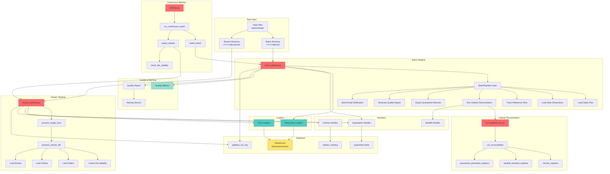

# Pipelines Directory

## Definition

The `pipelines/` directory contains the orchestration logic for the FastFeast data pipeline, including batch pipeline for dimension loading, stream pipeline for fact loading, orphan reconciliation, and continuous watching for real-time data processing.

## What It Does

The pipelines provide:

- **Batch Pipeline**: Daily dimension table loading with SCD2 versioning and automatic orphan reconciliation
- **Stream Pipeline**: Real-time fact data processing for orders, tickets, and events
- **Orphan Reconciliation**: Automatic detection and resolution of orphan references
- **Continuous Watching**: Polls for new data files and processes them automatically
- **Pipeline Orchestration**: Coordinates loaders, validators, handlers, and quality tracking

## Why It Exists

The pipelines are essential for:

- **Orchestration**: Coordinating multiple loaders and handlers in the correct sequence
- **Automation**: Automating data processing without manual intervention
- **Scheduling**: Running batch and stream processing on appropriate schedules
- **Error Handling**: Managing failures and retries at the pipeline level
- **Audit Trail**: Logging all pipeline operations to the audit schema
- **Quality Reporting**: Generating quality reports after pipeline completion

## How It Works

### Core Components

#### `batch_pipeline.py` - Batch Pipeline
Orchestrates daily dimension loading and orphan reconciliation:
- Loads dimension files for a specific date
- Triggers orphan reconciliation after dimension refresh
- Generates quality reports
- Sends email notifications

**Key Classes:**
- `BatchPipeline`: Main pipeline class with `run()` method

**Loading Sequence:**
1. Find batch directory for the date
2. Load static reference data (channels, priorities, reasons)
3. Load main dimension files (customers, drivers, restaurants, agents)
4. Track reference files (regions, cities, segments, categories, teams)
5. Run orphan reconciliation
6. Export quarantine records
7. Generate and email quality report

**Reconciliation Flow:**
- If batch directory missing: runs reconciliation only
- If batch directory found: loads dimensions then reconciliation
- Resolved orphans get new fact versions
- Persistent orphans are retried then quarantined

#### `stream_pipeline.py` - Stream Pipeline
Orchestrates real-time fact data processing:
- Processes hourly micro-batches of fact data
- Validates and loads orders, tickets, and events
- Detects orphan references
- Tracks quality metrics

**Key Functions:**
- `process_single_hour(date, hour)`: Processes one hour of stream data
- `process_stream_file()`: Processes a single stream file

**Processing Sequence:**
1. Find stream directory for date/hour
2. Check file stability (ensure files are fully written)
3. Load orders with orphan detection
4. Load tickets with orphan detection
5. Load ticket events
6. Track quality metrics
7. Export quarantine records

#### `reconciliation_job.py` - Orphan Reconciliation
Handles orphan reference resolution:
- Detects orphan references in fact tables
- Checks if dimensions now exist in batch data
- Creates new fact versions with correct keys
- Marks resolved orphans
- Quarantines persistent orphans

**Key Functions:**
- `run_reconciliation()`: Main reconciliation entry point
- `resolve_orphans()`: Resolves orphan references
- `backfill_resolved_orphans()`: Creates new fact versions
- `quarantine_persistent_orphans()`: Quarantines unresolvable orphans

**Reconciliation Logic:**
1. Query orphan_tracking for unresolved orphans
2. For each orphan:
   - Check if dimension exists in current dimension data
   - If exists: get correct surrogate key
   - If not exists: increment retry count
3. For resolved orphans:
   - Create new fact version with correct key
   - Set `is_backfilled = true`
   - Mark orphan as resolved
4. For persistent orphans (retry > 3):
   - Quarantine the orphan record

#### `watcher.py` - Continuous Watcher
Polls for new data files and processes them automatically:
- Monitors batch and stream input directories
- Processes batch data during configured window
- Processes stream data continuously
- Handles file stability checks

**Key Functions:**
- `run_continuous_watch()`: Main watcher loop
- `watch_batch()`: Watches for batch data
- `watch_stream()`: Watches for stream data
- `check_file_stability()`: Ensures files are fully written

**Watcher Logic:**
- Polls directories at configured intervals
- Checks for required files before processing batch
- Processes stream files as they appear
- Runs indefinitely until interrupted

## Relationship with Architecture

### Architecture Diagram



### Dependencies
- **loaders/**: All dimension and fact loaders
- **handlers/**: Orphan, quarantine, and backfill handlers
- **validators/**: Schema validation
- **quality/**: Quality metrics and reporting
- **alerting/**: Email notifications
- **warehouse/connection.py**: Database connection
- **config/settings.py**: Configuration

### Used By
- **main.py**: CLI entry point calls pipeline functions
- **watcher.py**: Continuous watcher calls pipeline functions
- **Operators**: Manual execution via CLI commands

### Integration Points
1. **CLI**: `python main.py batch --date YYYY-MM-DD`
2. **CLI**: `python main.py stream --date YYYY-MM-DD --hour H`
3. **CLI**: `python main.py stream --watch`
4. **Scheduler**: Can be scheduled via cron or other scheduler
5. **Quality Layer**: All pipelines report quality metrics
6. **Alerting**: Batch pipeline sends quality reports

## Pipeline Execution

### Batch Pipeline Execution
```bash
python main.py batch --date 2026-04-25
```

**Steps:**
1. Initialize connection pool
2. Ensure audit schema exists
3. Start pipeline run log
4. Find batch directory
5. Load static reference data
6. Load dimension files
7. Track reference files
8. Run orphan reconciliation
9. Complete pipeline run log
10. Export quarantine records
11. Generate quality report
12. Send email notification
13. Close connection pool

### Stream Pipeline Execution (Single Hour)
```bash
python main.py stream --date 2026-04-25 --hour 12
```

**Steps:**
1. Initialize connection pool
2. Ensure audit schema exists
3. Start pipeline run log
4. Find stream directory
5. Check file stability
6. Load orders
7. Load tickets
8. Load events
9. Complete pipeline run log
10. Export quarantine records
11. Close connection pool

### Continuous Watcher Execution
```bash
python main.py stream --watch
```

**Steps:**
1. Initialize connection pool
2. Ensure audit schema exists
3. Start watcher loop
4. Watch for batch data (during configured window)
5. Watch for stream data (continuous)
6. Process files as they appear
7. Run until interrupted (Ctrl+C)
8. Close connection pool

## Configuration

Pipelines use configuration from:
- **config/settings.py**: Directory paths, polling intervals, batch windows
- **Environment variables**: BATCH_INPUT_DIR, STREAM_INPUT_DIR, POLL_INTERVAL_SECONDS, etc.

### Batch Window Configuration
```bash
BATCH_WINDOW_START_HOUR=23  # Start checking for batch data at 11 PM
BATCH_WINDOW_END_HOUR=1     # Stop checking at 1 AM next day
BATCH_POLL_SECONDS=30       # Check every 30 seconds
```

### Stream Polling Configuration
```bash
STREAM_POLL_SECONDS=30       # Check for stream data every 30 seconds
```

### Required Batch Files
```bash
BATCH_REQUIRED_FILES=customers.csv,drivers.csv,agents.csv,regions.csv,reasons.csv,categories.csv,segments.csv,teams.csv,channels.csv,priorities.csv,reason_categories.csv,restaurants.json,cities.json
```

## File Stability Check

Stream pipeline checks file stability before processing:
- Compares file modification time
- Waits for file to be stable (no changes for configured interval)
- Prevents processing partially written files
- Reduces risk of processing incomplete data

## Error Handling

Pipelines handle errors at multiple levels:
- **File Level**: Individual file failures don't stop pipeline
- **Loader Level**: Loader errors are logged and tracked
- **Pipeline Level**: Critical errors fail the pipeline run
- **Retry Logic**: Transient errors are retried
- **Audit Trail**: All errors logged to pipeline_run_log

## Quality Reporting

Batch pipeline generates quality reports:
- Aggregate KPIs (total records, loaded, quarantined, orphaned)
- Per-file quality metrics
- Quality rates (null rate, duplicate rate, orphan rate, quarantine rate)
- PDF report generation
- Email notification with attachment

## Orphan Reconciliation

### Automatic Reconciliation
- Runs automatically after batch pipeline
- Resolves orphans when new dimensions arrive
- Creates new fact versions with correct keys
- Tracks resolution status

### Manual Reconciliation
- Can be run independently via reconciliation_job
- Useful for reprocessing historical orphans
- Can be triggered by external systems

## Performance Considerations

- **Connection Pooling**: Uses connection pool for database operations
- **Bulk Operations**: Loaders use bulk inserts for efficiency
- **File Hashing**: Tracks processed files by hash to avoid reprocessing
- **Parallel Processing**: Can run multiple pipeline instances (with proper coordination)
- **Batch Size**: Configurable batch size for bulk operations

## Monitoring

Pipelines provide monitoring via:
- **Pipeline Run Log**: Tracks each pipeline execution
- **File Tracker**: Tracks each file processed
- **Quality Metrics**: Per-file quality metrics
- **Structured Logging**: Detailed logs for debugging
- **Alerting**: Email notifications for failures

## Extending Pipelines

### Adding New Dimension to Batch Pipeline
1. Add loader to pipelines/batch_pipeline.py
2. Add to _load_main_file() or _load_static_files()
3. Update BATCH_REQUIRED_FILES configuration
4. Test with generated data

### Adding New Fact to Stream Pipeline
1. Add loader to pipelines/stream_pipeline.py
2. Add to process_stream_file() or process_single_hour()
3. Update file stability check if needed
4. Test with generated data

### Adding New Pipeline Type
1. Create new pipeline file following existing patterns
2. Implement run() method
3. Add to main.py CLI
4. Add configuration settings
5. Add to watcher if needed
