# Tests Directory

## Definition

The `tests/` directory contains test files for the FastFeast data pipeline. These tests validate the functionality of various components including loaders, validators, handlers, and pipeline operations.

## What It Does

The tests directory provides:

- **Unit Tests**: Test individual components in isolation
- **Integration Tests**: Test interactions between components
- **End-to-End Tests**: Test complete pipeline workflows
- **Quality Validation**: Test data quality and validation logic
- **Orphan Resolution Tests**: Test orphan detection and reconciliation

## Why It Exists

The tests directory is essential for:

- **Quality Assurance**: Ensuring code changes don't break existing functionality
- **Regression Testing**: Catching regressions when code is modified
- **Documentation**: Tests serve as executable documentation of expected behavior
- **Confidence**: Providing confidence when deploying changes to production
- **Debugging**: Isolating and fixing bugs more quickly

## How It Works

### Test Files

#### `test_alert.py`
Tests the alerting service:
- Email sending functionality
- Alert triggering conditions
- Report generation and attachment
- SMTP configuration

#### `test_file_tracker.py`
Tests file tracking functionality:
- File hash computation
- File deduplication
- File status tracking
- Idempotent processing

#### `test_orphan.py`
Tests orphan detection and tracking:
- Orphan detection logic
- Orphan tracking in database
- Orphan resolution
- Orphan quarantine

#### `test_orphan_resolution_flow.py`
Tests the complete orphan resolution workflow:
- End-to-end orphan detection
- Batch dimension loading
- Orphan reconciliation
- Backfill operations
- Persistent orphan handling

#### `test_quality_report_email_integration.py`
Tests quality report generation and email integration:
- PDF report generation
- Email attachment
- Quality metrics calculation
- Report content validation

#### `test_watcher.py`
Tests the continuous watcher:
- File polling logic
- Batch window detection
- Stream file detection
- File stability checks

#### `inspect_audit_schema.py`
Utility script to inspect the audit schema:
- Lists tables in pipeline_audit schema
- Shows table structures
- Useful for debugging and validation

### Test Framework

The project uses pytest as the test framework:
- **Discovery**: Automatically discovers test files matching `test_*.py`
- **Fixtures**: Provides setup/teardown for tests
- **Assertions**: Rich assertion messages
- **Coverage**: Can generate coverage reports

## Relationship with Architecture

### Architecture Diagram

```mermaid
graph TB
    subgraph "Test Suite"
        TS[tests/]
        TA[test_alert.py]
        TFT[test_file_tracker.py]
        TO[test_orphan.py]
        TORF[test_orphan_resolution_flow.py]
        TQRE[test_quality_report_email_integration.py]
        TW[test_watcher.py]
        IAS[inspect_audit_schema.py]
    end

    subgraph "Test Framework"
        PT[pytest]
        PC[pytest-cov]
        FX[Fixtures]
        ASM[Assertions]
        CR[Coverage Reports]
    end

    subgraph "Application Code"
        subgraph "Components"
            AL[alerting/]
            LD[loaders/]
            VL[validators/]
            HD[handlers/]
            PL[pipelines/]
            QL[quality/]
            UT[utils/]
        end
    end

    subgraph "Test Database"
        TDB[Test Database<br/>fastfeast_test_db]
        TSC[Test Schema]
        TTD[Test Data]
    end

    subgraph "Test Execution"
        DEV[Developers]
        CI[CI/CD Pipeline]
        CR2[Code Review]
    end

    subgraph "Test Categories"
        UT1[Unit Tests]
        IT[Integration Tests]
        E2E[End-to-End Tests]
    end

    TS --> TA
    TS --> TFT
    TS --> TO
    TS --> TORF
    TS --> TQRE
    TS --> TW
    TS --> IAS

    TA --> PT
    TFT --> PT
    TO --> PT
    TORF --> PT
    TQRE --> PT
    TW --> PT

    PT --> FX
    PT --> ASM
    PT --> CR

    TA --> AL
    TFT --> UT
    TO --> HD
    TORF --> HD
    TORF --> PL
    TQRE --> QL
    TW --> PL

    TA --> TDB
    TFT --> TDB
    TO --> TDB
    TORF --> TDB
    TQRE --> TDB
    TW --> TDB

    TDB --> TSC
    TDB --> TTD

    DEV --> PT
    CI --> PT
    CR2 --> PT

    TA --> UT1
    TFT --> UT1
    TO --> IT
    TORF --> E2E
    TQRE --> IT
    TW --> IT

    style TS fill:#ff6b6b
    style PT fill:#4ecdc4
    style TDB fill:#ffe66d
    style DEV fill:#95e1d3
```



### Dependencies
- **pytest**: Test framework
- **pytest-cov**: Coverage reporting (optional)
- **Application Code**: All modules being tested
- **Test Database**: Separate database for testing (recommended)

### Used By
- **Developers**: Run tests during development
- **CI/CD**: Automated testing in deployment pipelines
- **Code Review**: Verify changes don't break existing functionality

### Integration Points
1. **Loaders**: Test dimension and fact loading logic
2. **Validators**: Test schema validation and business rules
3. **Handlers**: Test orphan detection and quarantine
4. **Pipelines**: Test batch and stream pipeline orchestration
5. **Quality**: Test quality metrics and reporting

## Running Tests

### Run All Tests
```bash
pytest
```

### Run Specific Test File
```bash
pytest tests/test_alert.py
```

### Run Specific Test Function
```bash
pytest tests/test_orphan.py::test_orphan_detection
```

### Run with Coverage
```bash
pytest --cov=. --cov-report=html
```

### Run with Verbose Output
```bash
pytest -v
```

### Run with Detailed Output
```bash
pytest -vv
```

## Test Organization

### Test Structure
Tests are organized by component:
- `test_alert.py`: Alerting service tests
- `test_file_tracker.py`: File tracking tests
- `test_orphan.py`: Orphan detection tests
- `test_orphan_resolution_flow.py`: Orphan resolution workflow tests
- `test_quality_report_email_integration.py`: Quality report tests
- `test_watcher.py`: Watcher tests

### Test Naming Convention
- Test files: `test_*.py`
- Test classes: `Test*`
- Test functions: `test_*`

## Test Categories

### Unit Tests
Test individual functions and classes in isolation:
- Test a single loader
- Test a single validator
- Test a single handler function

### Integration Tests
Test interactions between components:
- Test loader + validator integration
- Test handler + database integration
- Test pipeline + quality integration

### End-to-End Tests
Test complete workflows:
- Test complete batch pipeline
- Test complete stream pipeline
- Test orphan resolution flow

## Test Configuration

### pytest.ini
Create `pytest.ini` in project root for configuration:
```ini
[pytest]
testpaths = tests
python_files = test_*.py
python_classes = Test*
python_functions = test_*
addopts = -v --tb=short
```

### Environment Variables
Tests may require environment variables:
- `TEST_DB_HOST`: Test database host
- `TEST_DB_NAME`: Test database name
- `TEST_DB_USER`: Test database user
- `TEST_DB_PASSWORD`: Test database password

## Test Database

### Recommended Setup
Use a separate test database to avoid affecting production data:
- Create test database: `fastfeast_test_db`
- Run migrations on test database
- Seed with test data
- Clean up after tests

### Test Data
Use fixtures to create test data:
- Create test dimension data
- Create test fact data
- Create test quarantine records
- Clean up after each test

## Best Practices

### Test Isolation
- Each test should be independent
- Use fixtures for setup/teardown
- Clean up after each test
- Don't rely on test execution order

### Test Coverage
- Aim for high coverage on critical paths
- Test happy path and error cases
- Test edge cases and boundary conditions
- Test data quality scenarios

### Test Speed
- Keep tests fast for quick feedback
- Use mocks for external dependencies (email, SMTP)
- Use in-memory database if possible
- Parallelize tests where safe

### Test Maintenance
- Keep tests updated with code changes
- Remove obsolete tests
- Refactor duplicated test code
- Document complex test scenarios

## Writing New Tests

### Test Template
```python
import pytest
from module import function_to_test

def test_function_to_test_success():
    """Test that function_to_test works correctly."""
    # Arrange
    input_data = {...}
    
    # Act
    result = function_to_test(input_data)
    
    # Assert
    assert result == expected_result

def test_function_to_test_error():
    """Test that function_to_test handles errors correctly."""
    # Arrange
    input_data = {...}
    
    # Act & Assert
    with pytest.raises(ExpectedException):
        function_to_test(input_data)
```

### Adding Tests for New Components
1. Create test file: `tests/test_new_component.py`
2. Import the component to test
3. Write test functions for each public method
4. Test both success and error cases
5. Add fixtures for setup/teardown if needed
6. Run tests to verify they pass

## CI/CD Integration

### GitHub Actions Example
```yaml
name: Tests
on: [push, pull_request]
jobs:
  test:
    runs-on: ubuntu-latest
    steps:
      - uses: actions/checkout@v2
      - name: Set up Python
        uses: actions/setup-python@v2
        with:
          python-version: '3.12'
      - name: Install dependencies
        run: |
          pip install -r requirements.txt
          pip install pytest pytest-cov
      - name: Run tests
        run: pytest --cov=. --cov-report=xml
      - name: Upload coverage
        uses: codecov/codecov-action@v2
```

## Troubleshooting

### Tests Failing
- Check if database is running
- Verify test database exists
- Check environment variables
- Review test logs for specific errors

### Import Errors
- Ensure virtual environment is activated
- Check PYTHONPATH includes project root
- Verify dependencies are installed

### Database Errors
- Check test database connection
- Verify schema is created in test database
- Ensure test data is seeded

## Extending Test Suite

### Adding Test Categories
1. Create new test file for category
2. Add appropriate fixtures
3. Write tests for category
4. Update documentation

### Adding Test Utilities
1. Create `tests/conftest.py` for shared fixtures
2. Add helper functions for common test operations
3. Add custom assertions if needed
4. Document utility functions
