# Warehouse Directory

## Definition

The `warehouse/` directory contains database schema definitions, connection management, and data warehouse structure for the FastFeast data pipeline. It defines the PostgreSQL database schema including dimension tables, fact tables, audit tables, and analytics views.

## What It Does

The warehouse directory provides:

- **Database Schema**: DDL scripts for creating database tables and schemas
- **Connection Management**: PostgreSQL connection pool and query execution
- **Schema Definition**: Dimension tables (SCD2), fact tables, and reference tables
- **Audit Schema**: Tables for tracking pipeline runs, file processing, and quality metrics
- **Analytics Views**: OLAP views for reporting and analytics
- **Seed Data**: Initial data for reference tables

## Why It Exists

The warehouse directory is essential for:

- **Data Storage**: Providing the database schema for storing transformed data
- **Connection Management**: Managing database connections efficiently with pooling
- **Schema Versioning**: Tracking database schema changes in version control
- **Audit Trail**: Providing tables for tracking pipeline operations
- **Analytics**: Pre-defining views for common analytics queries

## How It Works

### Core Components

#### `connection.py` - Database Connection Management
Manages PostgreSQL database connections:
- Thread-safe connection pool using psycopg2
- Context managers for safe connection handling
- Automatic transaction management
- Health check functionality
- Bulk operation helpers

**Key Functions:**
- `init_pool()`: Initializes the connection pool
- `close_pool()`: Closes the connection pool
- `health_check()`: Checks database connectivity
- `get_conn()`: Context manager for getting a connection
- `get_cursor()`: Context manager for getting a cursor
- `get_dict_cursor()`: Context manager for getting a dict cursor
- `execute_values()`: Bulk insert helper
- `execute_many()`: Bulk operation helper

**Connection Pool Configuration:**
- Min connections: 2 (configurable)
- Max connections: 10 (configurable)
- Thread-safe: Yes
- Automatic cleanup: Yes

#### `dwh_ddl.sql` - Data Warehouse Schema
Defines the main data warehouse schema:
- Dimension tables with SCD2 support
- Fact tables for transactional data
- Reference tables for lookup data
- Indexes for performance
- Constraints for data integrity

**Schema Components:**
- **Dimensions**: dim_customer, dim_driver, dim_restaurant, dim_agent, dim_date
- **Facts**: fact_orders, fact_tickets, fact_ticket_events
- **Reference**: ref_city, ref_region, ref_segment, ref_category, ref_team, ref_reason, ref_channel, ref_priority

**Dimension Table Pattern:**
```sql
CREATE TABLE dim_customer (
    customer_key    SERIAL PRIMARY KEY,
    customer_id     INTEGER,
    customer_name   VARCHAR(256),
    valid_from      DATE NOT NULL,
    valid_to        DATE,
    is_current      BOOLEAN DEFAULT TRUE
);
```

**Fact Table Pattern:**
```sql
CREATE TABLE fact_orders (
    order_id        UUID PRIMARY KEY,
    customer_key    INTEGER,
    driver_key      INTEGER,
    restaurant_key INTEGER,
    order_amount    NUMERIC(10,2),
    order_date      DATE,
    version         INTEGER DEFAULT 1,
    is_backfilled   BOOLEAN DEFAULT FALSE
);
```

#### `audit_ddl.sql` - Audit Schema
Defines the pipeline audit schema:
- Pipeline run logging
- File tracking
- Quarantine records
- Orphan tracking
- Quality metrics

**Schema Components:**
- **pipeline_run_log**: Tracks each pipeline execution
- **file_tracker**: Tracks each file processed
- **quarantine**: Stores quarantined records
- **orphan_tracking**: Tracks orphan references
- **pipeline_quality_metrics**: Stores quality metrics

**Audit Table Pattern:**
```sql
CREATE TABLE pipeline_audit.pipeline_run_log (
    run_id          SERIAL PRIMARY KEY,
    run_type        VARCHAR(20),
    run_date        DATE,
    status          VARCHAR(20),
    started_at      TIMESTAMP,
    completed_at    TIMESTAMP,
    total_files     INTEGER,
    successful_files INTEGER,
    failed_files    INTEGER
);
```

#### `analytics_ddl.sql` - Analytics Views
Defines OLAP views for analytics:
- KPI summary views
- Dimensional breakdowns
- Trend analysis views
- Revenue impact views

**View Components:**
- **v_kpi_summary**: Overall KPI metrics
- **v_tickets_by_location**: Tickets by city/region
- **v_tickets_by_restaurant**: Tickets by restaurant
- **v_tickets_by_driver**: Tickets by driver
- **v_sla_by_priority**: SLA metrics by priority
- **v_ticket_trends_hourly**: Hourly ticket trends
- **v_ticket_reopen_rate**: Ticket reopen rate
- **v_revenue_impact**: Revenue impact from refunds

#### `seed.sql` - Seed Data
Initial data for reference tables:
- Static reference data
- Default configurations
- Lookup table initial values

**Seed Data Components:**
- Reason categories and reasons
- Channels
- Priorities with SLA thresholds
- Default regions and cities

## Relationship with Architecture

### Architecture Diagram

```mermaid
graph TB
    subgraph "Warehouse Directory"
        WH[warehouse/]
        CP[connection.py]
        DDL[dwh_ddl.sql]
        ADL[audit_ddl.sql]
        ANDL[analytics_ddl.sql]
        SD[seed.sql]
    end

    subgraph "Connection Management"
        subgraph "Functions"
            IP[init_pool]
            CLP[close_pool]
            HC[health_check]
            GC[get_conn]
            GCR[get_cursor]
            GDC[get_dict_cursor]
            EV[execute_values]
            EM[execute_many]
        end
        subgraph "Pool"
            CP2[Connection Pool<br/>Thread-safe]
            MIN[Min: 2]
            MAX[Max: 10]
        end
    end

    subgraph "Database Schemas"
        subgraph "dwh Schema"
            subgraph "Dimensions"
                DC[dim_customer]
                DDR[dim_driver]
                DRES[dim_restaurant]
                DAG[dim_agent]
                DD[dim_date]
            end
            subgraph "Facts"
                FO[fact_orders]
                FT[fact_tickets]
                FTE[fact_ticket_events]
            end
            subgraph "Reference"
                RC[ref_city]
                RREG[ref_region]
                RSEG[ref_segment]
                RCAT[ref_category]
                RT[ref_team]
                RR[ref_reason]
                RCH[ref_channel]
                RP[ref_priority]
            end
        end
        subgraph "pipeline_audit Schema"
            PRL[pipeline_run_log]
            FT[file_tracker]
            QT[quarantine table]
            OT[orphan_tracking]
            PQM[pipeline_quality_metrics]
        end
        subgraph "Analytics Views"
            V1[v_kpi_summary]
            V2[v_tickets_by_location]
            V3[v_tickets_by_restaurant]
            V4[v_tickets_by_driver]
            V5[v_sla_by_priority]
            V6[v_ticket_trends_hourly]
            V7[v_ticket_reopen_rate]
            V8[v_revenue_impact]
        end
    end

    subgraph "Application Modules"
        LD[loaders/]
        HD[handlers/]
        QL[quality/]
        PL[pipelines/]
        AN[analytics/]
    end

    subgraph "PostgreSQL Database"
        PG[PostgreSQL Server]
        DB[fastfeast_db]
    end

    WH --> CP
    WH --> DDL
    WH --> ADL
    WH --> ANDL
    WH --> SD

    CP --> IP
    CP --> CLP
    CP --> HC
    CP --> GC
    CP --> GCR
    CP --> GDC
    CP --> EV
    CP --> EM
    CP --> CP2
    CP2 --> MIN
    CP2 --> MAX

    DDL --> DC
    DDL --> DDR
    DDL --> DRES
    DDL --> DAG
    DDL --> DD
    DDL --> FO
    DDL --> FT
    DDL --> FTE
    DDL --> RC
    DDL --> RREG
    DDL --> RSEG
    DDL --> RCAT
    DDL --> RT
    DDL --> RR
    DDL --> RCH
    DDL --> RP

    ADL --> PRL
    ADL --> FT
    ADL --> QT
    ADL --> OT
    ADL --> PQM

    ANDL --> V1
    ANDL --> V2
    ANDL --> V3
    ANDL --> V4
    ANDL --> V5
    ANDL --> V6
    ANDL --> V7
    ANDL --> V8

    SD --> RC
    SD --> RREG
    SD --> RR
    SD --> RCH
    SD --> RP

    LD --> CP
    HD --> CP
    QL --> CP
    PL --> CP
    AN --> CP

    CP --> PG
    PG --> DB

    style WH fill:#ff6b6b
    style CP fill:#4ecdc4
    style DDL fill:#4ecdc4
    style ADL fill:#4ecdc4
    style ANDL fill:#4ecdc4
    style PG fill:#ffe66d
    style LD fill:#95e1d3
```



### Dependencies
- **psycopg2**: PostgreSQL adapter for Python
- **psycopg2.pool**: Connection pooling
- **config/settings.py**: Database configuration

### Used By
- **loaders/**: All loaders use connection.py for database operations
- **handlers/**: Handlers use connection.py for database operations
- **quality/**: Quality layer uses connection.py for audit operations
- **pipelines/**: Pipelines use connection.py for orchestration
- **analytics/**: Analytics uses connection.py for querying views

### Integration Points
1. **Database Initialization**: DDL scripts run via `python main.py init-db`
2. **Loaders**: Use connection pool for all database operations
3. **Audit Trail**: All operations log to audit schema
4. **Analytics**: Views queried by analytics dashboard

## Database Schemas

### dwh Schema
Main data warehouse schema:
- **Dimension Tables**: SCD2 versioned dimension data
- **Fact Tables**: Transactional data with versioning
- **Reference Tables**: Static lookup data

### pipeline_audit Schema
Audit and tracking schema:
- **Pipeline Run Log**: Tracks pipeline executions
- **File Tracker**: Tracks file processing
- **Quarantine**: Stores invalid records
- **Orphan Tracking**: Tracks orphan references
- **Quality Metrics**: Stores quality metrics

### Analytics Schema
OLAP views for reporting:
- **KPI Views**: Aggregate metrics
- **Dimensional Views**: Breakdowns by dimension
- **Trend Views**: Time-based analysis
- **Revenue Views**: Financial impact analysis

## Connection Pool Management

### Pool Initialization
```python
from warehouse.connection import init_pool

init_pool(
    host="localhost",
    port=5432,
    dbname="fastfeast_db",
    user="fastfeast",
    password="fastfeast_pass",
    min_connections=2,
    max_connections=10
)
```

### Using Context Managers
```python
from warehouse.connection import get_cursor

with get_cursor() as cursor:
    cursor.execute("SELECT * FROM dim_customer")
    results = cursor.fetchall()
```

### Bulk Operations
```python
from warehouse.connection import execute_values

execute_values(
    cursor,
    "INSERT INTO dim_customer (customer_id, customer_name) VALUES %s",
    [(1, "John"), (2, "Jane")]
)
```

## Schema Management

### Applying DDL Scripts
```bash
# Apply warehouse schema
psql -h localhost -U fastfeast -d fastfeast_db -f warehouse/dwh_ddl.sql

# Apply audit schema
psql -h localhost -U fastfeast -d fastfeast_db -f warehouse/audit_ddl.sql

# Apply analytics views
psql -h localhost -U fastfeast -d fastfeast_db -f warehouse/analytics_ddl.sql

# Apply seed data
psql -h localhost -U fastfeast -d fastfeast_db -f warehouse/seed.sql
```

### Via CLI
```bash
python main.py init-db
```

## SCD2 Implementation

### Dimension Table Structure
- **surrogate_key**: Auto-incrementing primary key
- **natural_key**: Business key from source system
- **attributes**: Dimension attributes
- **valid_from**: Effective start date
- **valid_to**: Effective end date (NULL for current)
- **is_current**: Boolean flag for current records

### Change Tracking
- New records: `valid_from = batch_date`, `valid_to = NULL`, `is_current = TRUE`
- Expired records: `valid_to = batch_date - 1`, `is_current = FALSE`
- Current records: Query with `WHERE is_current = TRUE`

## Fact Table Versioning

### Version Management
- **version**: Version number (starts at 1)
- **is_backfilled**: Flag for backfilled records
- Unique constraint on (natural_key, version)

### Backfill Process
- Original record: version=1, is_backfilled=FALSE
- Backfilled record: version=2, is_backfilled=TRUE
- Both records kept for audit trail

## Indexing Strategy

### Dimension Indexes
- Natural key index: For lookups
- Current record index: For querying current records
- Valid date index: For time-based queries

### Fact Indexes
- Foreign key indexes: For joins
- Date indexes: For time-based queries
- Version indexes: For backfill queries

### Audit Indexes
- Run ID indexes: For run lookups
- File path indexes: For file tracking
- Date indexes: For time-based queries

## Performance Considerations

### Connection Pooling
- Reuse connections to reduce overhead
- Configure appropriate pool size
- Use context managers for cleanup
- Monitor pool usage

### Query Optimization
- Use appropriate indexes
- Use prepared statements
- Batch operations where possible
- Analyze query plans

### Bulk Operations
- Use execute_values for bulk inserts
- Use execute_many for bulk updates
- Batch size configurable
- Monitor transaction size

## Security Considerations

### Connection Security
- Use SSL in production
- Store credentials in environment variables
- Use least privilege principle
- Rotate credentials regularly

### Data Security
- Encrypt sensitive data at rest
- Use row-level security if needed
- Audit database access
- Regular security updates

## Backup and Recovery

### Backup Strategy
- Regular full backups
- Point-in-time recovery
- Test restore procedures
- Store backups securely

### Recovery Procedures
- Document recovery steps
- Test recovery regularly
- Have recovery time objectives
- Have recovery point objectives

## Monitoring

### Database Monitoring
- Connection pool usage
- Query performance
- Table sizes
- Index usage

### Alerting
- Connection failures
- Long-running queries
- Disk space
- Replication lag (if applicable)

## Extending Warehouse Schema

### Adding New Dimension
1. Add table definition to dwh_ddl.sql
2. Add appropriate indexes
3. Add constraints
4. Update loader to populate table
5. Update analytics views if needed

### Adding New Fact
1. Add table definition to dwh_ddl.sql
2. Add foreign key indexes
3. Add date indexes
4. Update loader to populate table
5. Update analytics views if needed

### Adding New Audit Table
1. Add table definition to audit_ddl.sql
2. Add indexes
3. Update metrics_tracker to write to table
4. Update quality report if needed

### Adding New Analytics View
1. Add view definition to analytics_ddl.sql
2. Add to analytics client
3. Add to dashboard if needed
4. Test view performance
